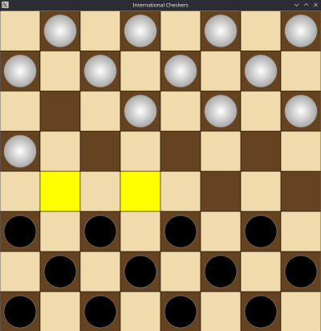
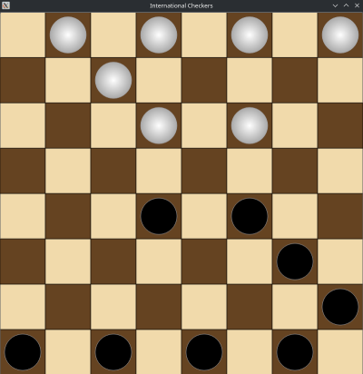

# Checkers Game (Qt and C++)

This project implements a two-player checkers game using Qt 5.12 or newer, written in C++. The game follows the international rules of checkers, as defined [here](https://en.wikipedia.org/wiki/International_draughts#Rules). It is a simple, fun, and interactive game where two human players take turns playing on the same app.

## Features

- **Two Players**: Both players are humans and take turns playing on the same app.
- **International Rules**: The game follows the international checkers rules.
- **Mouse Interaction**: Players can move pieces by clicking on the starting and ending squares (only mouse clicks are supported for movement).
- **Legal Moves Highlighted**: Each turn, the legal moves are visually highlighted for players to easily understand their options.

## Screenshots

Here are some screenshots from the game:

  


## How to Build and Run

To build and run the project, follow these steps:

1. Clone the repository:
   ```bash
   git clone https://github.com/KyaPr/QtCheckers.git
   ```

2. Install Qt 5.12 or newer on your system.

3. Open a terminal and navigate to the project directory.

4. Run `qmake` to generate the Makefile:
   ```bash
   qmake ../Checkers.pro
   ```

5. Build the project using `make`:
   ```bash
   make -j$(nproc)
   ```
   - `-j$(nproc)` uses all available CPU cores for faster compilation. You can remove it if you prefer using a single core.

6. After building, you can run the game from the terminal or from within Qt Creator.

## Requirements

- Qt 5.12 or newer
- C++14 or newer

